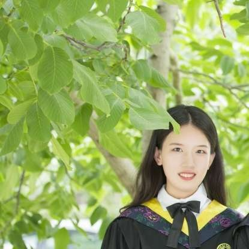

## About Me

Hi! I am Yintao He (何银涛), a first year Ph.D Student in State Key Laboratory of Computer Architecture, at Institute of Computing Technology, Chinese Academy of Sciences with Prof. Huawei Li and Prof. Ying Wang. Recently, I am focused on deep learning accelerator design based on ReRAM.

## Research Interest

In-Memory Computing, Deep Learning, Energy-Efficient Accelerators

## Education
* Sep. 2019 - Present: **ICT, CAS**

   PhD Student in Computer Systems and Architecure

* Sep. 2015 - Jun. 2019: **Nankai University**

   B.E. in Electonic Science and Techonology

## Publications

- **[DAC'20] Yintao He**, Ying Wang, Xiandong Zhao, Huawei Li, Xiaowei Li, “Towards State-Aware Computation in ReRAM Neural Networks,” in IEEE/ACM Proceedings of Design, Automation Conference, 2020.(CCF-A) Paper [Codes](https://github.com/wangying-ict/BWN_Shift)

- **[ICCAD'19] Yintao He**, Ying Wang, Yongchen Wang, Huawei Li, Xiaowei Li, “[An Agile Precision-Tunable CNN Accelerator based on ReRAM],” in IEEE/ACM International Conference On Computer Aided Design, 2019.(CCF-B) [Paper](https://ieeexplore.ieee.org/document/8942163)

## Honors and Awards

* 2020: UCAS Merit Student
* 2020: DAC 2020 Young Fellow Member
* 2019: Outstanding Graduation Thesis (Top 5 in the department)
* 2019: NKU Merit Student
* 2018: The First Prize Scholarship 
* 2018: NKU Merit Student
* 2017: Gongneng Scholarship
* 2016: NKU Excellent Student Cadre

## Contact Me

* Email: [heyintao19z@ict.ac.cn](mailto:heyintao19z@ict.ac.cn)

* Postal Address: No.6 Kexueyuan South Road Zhongguancun,Haidian District Beijing,China 100190

* Social Media: [zhihu](https://www.zhihu.com/people/he-jie-7-55) and [linkedin](https://www.linkedin.com/in/yintao-he-6b3637159/?originalSubdomain)

---

